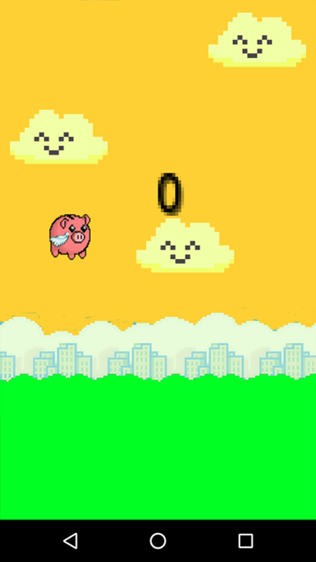
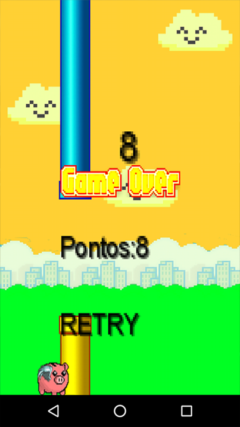
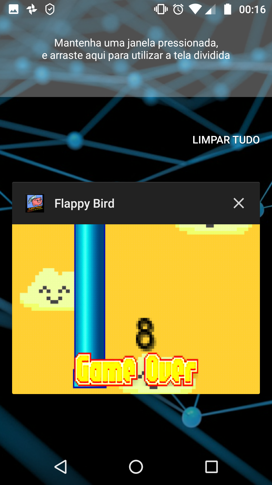

# FlappyBird_Clone
📱 An An Android Game: Flappy-Bird Clone done with Java Game Development Framework LibGDX during Udemy Course "Learn to create 15 apps" by Jamilton Damasceno. Using Nintendo's Super Mario Tubes and some "custom" Sprites. App done in 2018 with Android Studio 2.1.3

# ScreenShots:

